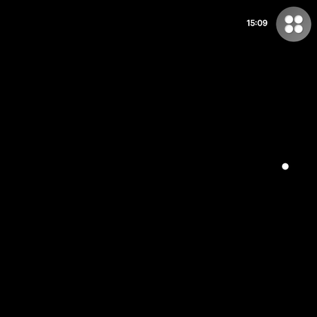

# agent-hud

A quiet display for [Raven Prism](https://raven.computer) smart glasses that tells you when something needs your attention.

You run coding agents and jobs on other machines. Today you find out how they are doing by going to a screen and looking. This tells you instead, in the corner of your vision, without you asking.

Most of the time it shows almost nothing. When something is waiting on you, a small number appears. Look at it and it opens to tell you what.

> **Not affiliated with Raven Resonance.** This is an independent project. The Raven Framework is separate proprietary software, installed by hand, and is never included here.

## How it looks



Four states:

| State | What is on screen |
|---|---|
| Nothing waiting | One small bright dot in the right periphery. Nothing else. |
| Something waiting | A card holding a number, and the words "need you" |
| Opened | Each item in its own row, with a line counting what did not fit |
| Cannot reach the gateway | The last known count stays, with an amber dot below it |

## What you need

- **Python 3.10 or later** for development. Deploying to real glasses needs exactly **3.12.12** — the Raven tooling checks the version string and refuses anything else.
- **Git**
- **The Raven Framework**, cloned and installed separately (see below)

## Setup

**1. Get this project**

```bash
git clone https://github.com/RBraga01/agent-hud
cd agent-hud
python -m venv .venv
```

Activate it: `source .venv/bin/activate` on macOS and Linux, `.venv\Scripts\activate` on Windows. If PowerShell blocks that, call the interpreter by path instead: `.venv\Scripts\python.exe`.

**2. Get the Raven Framework**

Agent HUD is MIT licensed. It depends on the Raven Framework, which is **separate proprietary software** — its source is public, but that does not by itself grant permission to use it. If you are authorized by Raven Resonance to use the Framework, install it following Raven's current developer instructions. Typically:

```bash
git clone https://github.com/RavenResonance/raven-framework
pip install -e ./raven-framework
```

It is not a dependency of this project and is never bundled with it. Cloned inside this folder it is already ignored by git, and `.ravignore` keeps it out of any deployment package.

**3. Install the development tools**

```bash
pip install -e ".[dev]"
```

## Running it

Start the stub gateway in one terminal:

```bash
python -m stub_server.server
```

And the app in another:

```bash
python main.py
```

The simulator opens. Your mouse stands in for where you are looking, a click stands in for the stare or blink that selects something, and the buttons along the bottom preview how it looks in daylight, at night and outdoors. Black shows as transparent, because the real display can only add light to the world — it can never darken it.

Now edit `stub_server/agents.json` and watch the glasses follow within a few seconds.

## Settings

All settings are optional and read from the environment. Nothing is written into the source.

| Variable | Default | What it does |
|---|---|---|
| `AGENT_HUD_GATEWAY_URL` | `http://127.0.0.1:8765/items` | Where to ask for the list |
| `AGENT_HUD_POLL_SECONDS` | `3` | How often to ask |
| `AGENT_HUD_FEEDERS` | `simulated` | Which sources to read, in order. Any of `simulated`, `claude`, `file` |
| `AGENT_HUD_SHOW_PROMPTS` | off | Show the last thing you asked Claude. Off on purpose |
| `AGENT_HUD_CLAUDE_PROJECTS` | `~/.claude/projects` | Where to look for Claude sessions |
| `AGENT_HUD_SKIP_PATH_WORDS` | — | Extra folder names to drop when naming a project from its path |

They are read straight from the environment. Set them before running:

```bash
# macOS / Linux
export AGENT_HUD_FEEDERS=claude,simulated
python main.py

# Windows PowerShell
$env:AGENT_HUD_FEEDERS = "claude,simulated"
python main.py
```

`.env.example` is a reference for what exists — it is **not loaded automatically**. There is no `dotenv` dependency. Copy the values you want into your shell, or wrap `main.py` in a script that exports them.

A bad value stops the app at startup with a clear message rather than leaving you with a display that quietly does nothing.

## Where the items come from

A **feeder** is the part that knows about one particular tool. The glasses app knows about none of them, which is why adding a source never means touching the app.

| Feeder | What it reads |
|---|---|
| `simulated` | Nothing. Invented items, so the app can be run and demonstrated with no accounts and no personal data. This is the default. |
| `claude` | Your live Claude Code sessions under `~/.claude/projects`. The last entry in a transcript says whose turn it is. |
| `file` | `stub_server/agents.json`, so you can drive the display by hand while testing. |

Choose them in order — the first one listed appears first on screen:

```bash
AGENT_HUD_FEEDERS=claude,simulated python -m stub_server.server
```

**Your prompt text is off by default.** With the `claude` feeder a row normally reads `your turn - 13 h`. Set `AGENT_HUD_SHOW_PROMPTS=1` and it shows the last thing you actually asked instead. That is your own writing, appearing on a display and passing through a file, so it is something you switch on rather than something you have to notice and switch off.

**The `claude` feeder reads an undocumented format.** Nothing promises those session files keep their shape, so it may stop working without warning. It earns its place by needing no setup at all. A Claude Code `Stop` hook is the supported way to do this and should replace it once you want it running for real.

## What the gateway sends

The app knows nothing about Codex, GitHub, or any other tool. It receives a list of items and draws them. Everything tool-specific belongs on the server side, so adding a new source never means changing and redeploying the glasses app.

```json
{
  "items": [
    {
      "id": "claude-deploy",
      "title": "Claude Code",
      "detail": "approve deploy?",
      "needs_you": true
    }
  ]
}
```

Four fields, nothing else. `title` and `detail` are already-written text — the app draws them, it never composes sentences. The number in the corner is how many items have `needs_you` set.

Parsing is strict. An entry that does not match this shape exactly is dropped rather than guessed at, because guessing would either hide work from you or invent work that is not there.

## Layout

```
main.py                 entry point
agent_hud/
  config.py             settings from the environment      no framework needed
  items.py              the contract and its parser        no framework needed
  client.py             fetching from the gateway          no framework needed
  interaction.py        when the detail is showing         no framework needed
  app.py                the screen                         needs the framework
feeders/
  simulated.py          invented items, no accounts needed no framework needed
  claude_sessions.py    reads live Claude Code sessions    no framework needed
stub_server/
  server.py             asks the feeders on every request  no framework needed
  agents.json           edit this when using the file feeder
tests/
```

Everything that can be plain Python is plain Python. The Raven Framework is proprietary and its licence grants no right to use it, so it is never installed in automated checks — which is why the screen tests skip there and everything else does not.

## Tests

```bash
pytest              # add -q for less noise
ruff check .
```

With the framework installed you get the full suite. Without it, the screen tests skip and the rest still run — the same thing the automated checks see.

## Roadmap

Where this is going, in the order it needs to happen.

| | | |
|---|---|---|
| **Done** | A quiet display | Nothing visible until something needs you; stare to see what |
| **Done** | Honest failure | A calm display and a broken one never look alike |
| **Done** | One request at a time | A slow gateway cannot walk the display backwards |
| **Next** | A supported Claude signal | A `Stop` hook instead of reading undocumented session files |
| **Next** | More sources | Codex and GitHub feeders, and an event-shaped gateway |
| **Then** | A real gateway | Authentication, TLS, and reachable from outside the machine, so the glasses can see agents running at home |
| **Then** | Asking out loud | Hold, ask "what needs me?", hear the answer |
| **Later** | Acting, carefully | Approving things by eye is a much bigger decision about safety than reading is. It comes last, on purpose, and only once reading has proved itself. |

**What is not built.** The gateway is a development server: no authentication, loopback only. It is fine for the simulator and unfit for anything else. Making it reachable over a network is a real piece of work, not a change of address.

**What has not been tested.** Agent HUD has run in Raven's simulator, not on physical Prism hardware. Eye-tracking accuracy, blink detection, the physical button and real-device performance are all unverified. The automated checks do not touch the on-glasses screen code at all — they cannot, because the Framework is not installed there.

## Deploying to glasses

The Raven Framework supports deployment. Deploying Agent HUD needs Raven-issued application credentials and access to Prism hardware, neither of which this project has yet. The Framework also requires the exact Python version its devices run (`3.12.12` at the time of writing) and checks the version string before it will build a package.

Credentials are read from the environment, so deploying never means editing tracked source:

```bash
export RAVEN_APP_ID=...
export RAVEN_APP_KEY=...
python main.py deploy
```

`.ravignore` restricts the uploaded package to `main.py` and `agent_hud/` — the framework, tests, feeders and documents are all kept out.

## Licence

MIT — see [LICENSE](LICENSE).

That covers this project's own code. The [Raven Framework](https://github.com/RavenResonance/raven-framework) is separate proprietary software with its own licence, installed by hand, and no part of it appears in this repository. Do not copy it here.
