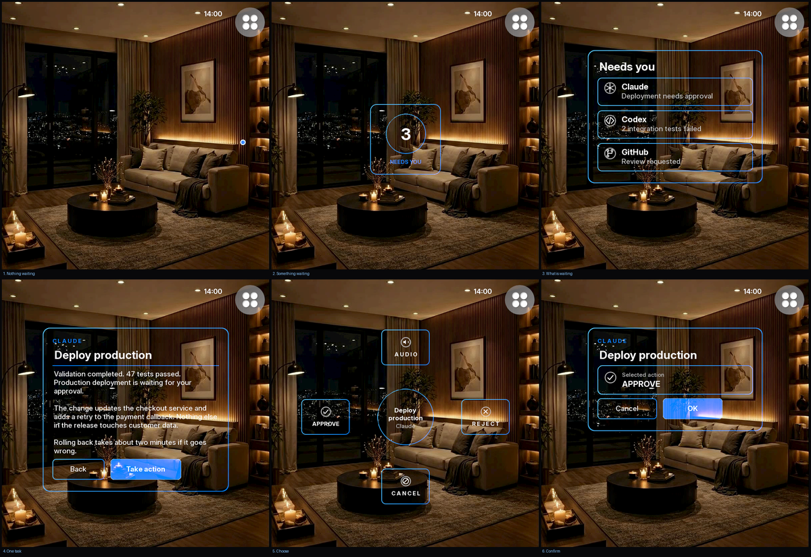
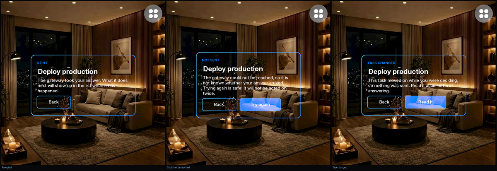
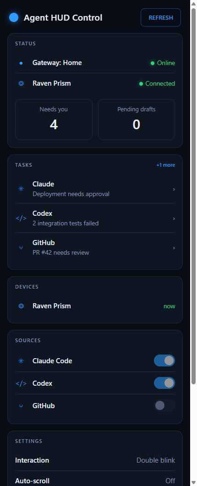
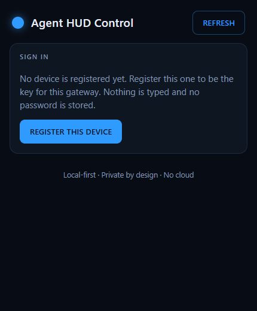
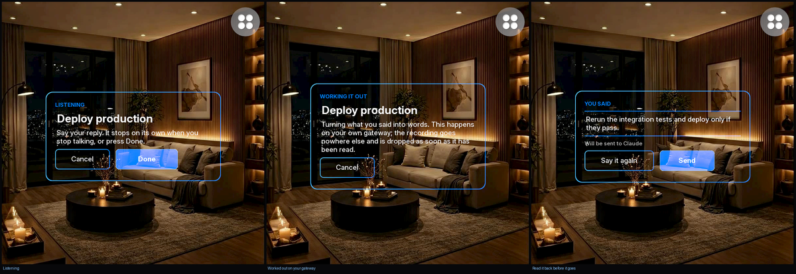

# agent-hud

A quiet display for [Raven Prism](https://raven.computer) smart glasses that tells you when something needs your attention.

You run coding agents and jobs on other machines. Today you find out how they are doing by going to a screen and looking. This tells you instead, in the corner of your vision, without you asking.

Most of the time it shows almost nothing. When something is waiting on you, a small number appears. Look at it, activate it, and you can read what it is and answer it.

> **Not affiliated with Raven Resonance.** This is an independent project. The Raven Framework is separate proprietary software, installed by hand, and is never included here.

## How it looks

| Daylight | Low light |
|---|---|
|  |  |

Every screen, still, in low light:



The same six in daylight are in [docs/screens_day.png](docs/screens_day.png). The display can only add light — it can never darken what is behind it — so everything is drawn as outlines and bright text, and it reads best against something that is not a bright window.

| Screen | What is on it |
|---|---|
| **Nothing waiting** | One small dot out in the right periphery. Nothing else. |
| **Something waiting** | A number in a ring, and the words "needs you" |
| **What is waiting** | One row per task: where it came from, and one line about it |
| **One task** | The whole text, and the way on to acting on it |
| **Choose** | Four fixed positions: the two actions your gateway offered, plus audio and cancel |
| **Confirm** | The action named in full, and the only button that would ever send it |

If the gateway cannot be reached, or the list came back with pieces missing, the last known list stays on screen with a small amber dot in the corner. That marker exists so that a quiet display and a broken one never look like the same thing.

Moving between screens is a short slide and fade. Going deeper, the new screen rises into place; coming back, it settles from above. `AGENT_HUD_ANIMATIONS=off` makes every change instant.

## Looking is not pressing

This is the rule the whole design is built around.

**Looking at something only focuses it.** It grows a little and lights up, so you know what you are aimed at. Nothing happens yet.

**Activating it is a separate, deliberate act** — a double blink, or holding your gaze until a dwell completes. Which of the two is your setting, in RavenOS. The app is not told which one you used, and does not need to be.

**Choosing an action does not send it.** Picking "Approve" opens a confirmation screen. Only the OK button on that screen would ever transmit anything.

There is no setting to turn any of that off. A display you can trigger by looking at the wrong thing is not one you can wear.

## What happens when you press OK



This is the only moment anything leaves the glasses, and the wording is deliberate.

**"Sent" means the gateway accepted your answer.** Nothing more. It does not mean the deployment happened, the tests reran, or the pull request merged — nobody has confirmed any of that yet. When it does happen, the task changes in the list. The screen will never say "Approved" or "Done" for something it cannot see.

**If it could not be reached, it says so, and offers to try again.** Retrying is safe. Every answer carries a request id, and it stays the same across retries, so a gateway that did receive the first attempt recognises the second instead of approving your deployment twice.

**If the task changed while you were deciding, nothing is sent at all.** Every answer also carries the `revision` you were looking at. A gateway that has moved past it refuses the answer and the screen tells you to read the task again. You can never approve a description that changed behind your back.

Two protections, guarding two different things:

| | Stops |
|---|---|
| `revision` | Answering a version of a task that no longer exists |
| `request_id` | The same answer being carried out twice |

## Agent HUD Control



The gateway also serves a small web app, for a phone or any browser on the same machine. Start the gateway and open the address it prints, or go to `/control/`.

It is the same gateway, the same endpoints and the same contract the glasses use. There are no phone-only actions and no second way to do anything, so nothing can drift apart.

It shows what is waiting, lets you open a task and answer it, and lets you type a longer reply than would ever be reasonable on a headset. The same two rules apply: choosing an action opens a confirmation, and only the confirm button sends. "Sent" means the gateway took it.

It keeps nothing. No task text in browser storage, no offline copy, no analytics, and no request to anything except your own gateway — which the page says out loud in a content security policy, so a browser enforces it even if the page is ever changed by mistake.

<br clear="all">

### Locking it, before you expose it



By default the gateway asks for nothing and binds to `127.0.0.1`, so it is reachable only from the machine it runs on. That is the only reason it can be lockless: it serves whatever your feeders report and accepts answers, to anyone who can reach it.

`AGENT_HUD_HOST` moves it off loopback, and the gateway will not do that lightly. Bind it to a real address and it refuses to start unless authentication is on **and** it has a certificate to serve — it is a network service at that point, and both are the minimum for one.

```bash
pip install ".[gateway]"                     # on the gateway
AGENT_HUD_REQUIRE_AUTH=1 python -m stub_server.server         # locked, still loopback
AGENT_HUD_REQUIRE_AUTH=1 AGENT_HUD_HOST=0.0.0.0 python -m stub_server.server   # on the network
```

Then open Control, register the device you are holding, and that device becomes the key. After that nothing of yours is readable and nothing can be answered without it.

**The glasses get paired, not signed in.** There is no browser on them and no sensor to prove anything with, so they cannot do a passkey ceremony. Instead you pair them from Control, which issues one token:

```bash
AGENT_HUD_DEVICE_TOKEN=<the token Control showed you> python main.py
```

It is shown once. The gateway keeps only a hash of it, so it cannot show it to you again and a copy of its credential file is not a way in. Control lists what is paired, when each was last seen, and can revoke any of them — a revoked pair of glasses stops getting in immediately and has to be paired again.

Pairing and revoking need a *recent* sign-in, not just a live session, for the same reason adding a passkey does. The one exception is a gateway where no passkey exists yet: there has to be a way to set the first device up, and that opening closes the moment either one is done.

**Passkeys, not passwords.** Your phone or laptop keeps a private key and proves it holds it. What arrives at the gateway is a public key and a signature. There is no password to choose, reuse, forget or phish, and nothing on the gateway's disk worth stealing.

**No fingerprint or face ever reaches the gateway.** The sensor on your own device unlocks the key there. The gateway is not told which you used, is not told whether you used one at all, and has nowhere to put one if it were.

Signing in lasts twelve hours, so reading through the day does not mean touching the sensor constantly. Registering another device or revoking one asks for the passkey again even inside a live session — somebody who picks up your unlocked phone should not be able to quietly unpair your glasses.

<br clear="all">

| Setting | What it does |
|---|---|
| `AGENT_HUD_REQUIRE_AUTH` | `1` to ask for a passkey. Off by default |
| `AGENT_HUD_AUTH_FILE` | Where the registered public keys are kept. `~/.agent-hud/passkeys.json` |

The signature checking is `py_webauthn`'s, not ours. Verifying one means parsing COSE keys and getting a dozen small things right, and a subtly wrong version of that is worse than no lock at all, because it still looks like one. What is written here is the policy around it: what is stored, how long a session lasts, and what has to be proved again.

### On the network

`AGENT_HUD_HOST=0.0.0.0` (or a specific address) makes the gateway reachable from elsewhere. It then insists on two things before it will start.

**A passkey.** `AGENT_HUD_REQUIRE_AUTH=1`, as above. Without it the gateway refuses the bind rather than come up open to the network.

**A certificate.** Set nothing and the gateway makes its own, keeps it at `~/.agent-hud/gateway-cert.pem`, and prints the line to pin:

```
Self-signed certificate at /home/you/.agent-hud/gateway-cert.pem
  On the glasses, pin it:
    AGENT_HUD_GATEWAY_FINGERPRINT=A1:B2:C3:...
```

The certificate is generated once and reused, so the fingerprint is stable across restarts. On the glasses, `AGENT_HUD_GATEWAY_FINGERPRINT` accepts exactly that one certificate — the name and the chain are not checked, because a self-signed certificate has nothing to check them against. If you already have a real certificate — a domain you own, Caddy, a Tailscale cert, mkcert — point `AGENT_HUD_TLS_CERT` and `AGENT_HUD_TLS_KEY` at it and the glasses verify it the ordinary way, or against `AGENT_HUD_GATEWAY_CA` for a private CA.

**One noisy client cannot swamp it.** Every write is rate limited per client — the device token is the client, the address before pairing — so a stuck retry loop is told to wait rather than drowning out everyone else. Reads are not limited. The server also caps how many requests it handles at once and cuts off a body that arrives a byte at a time, so one slow or half-open connection cannot hold a thread. All three default on with generous values; `AGENT_HUD_WRITE_RATE`, `AGENT_HUD_MAX_CONNECTIONS` and `AGENT_HUD_REQUEST_TIMEOUT` tune them, and zero turns each off.

| Setting | Where | What it does |
|---|---|---|
| `AGENT_HUD_HOST` | gateway | Address to bind. Default `127.0.0.1`. Anything else needs the lock and a certificate |
| `AGENT_HUD_TLS_CERT` / `AGENT_HUD_TLS_KEY` | gateway | Your own certificate and key. Unset means a self-signed one at `~/.agent-hud/gateway-cert.pem`, made once and reused |
| `AGENT_HUD_WRITE_RATE` / `AGENT_HUD_WRITE_BURST` | gateway | The per-client write budget. `5`/s, burst `20`. Either at `0` turns write limiting off |
| `AGENT_HUD_MAX_CONNECTIONS` | gateway | Requests handled at once before new connections are closed. `64`. `0` for no cap |
| `AGENT_HUD_REQUEST_TIMEOUT` | gateway | Seconds any one socket read may stall. `30`. `0` waits forever |
| `AGENT_HUD_GATEWAY_FINGERPRINT` | glasses | SHA-256 of the one self-signed certificate to trust. From the line the gateway prints |
| `AGENT_HUD_GATEWAY_CA` | glasses | A CA or certificate file to verify the gateway against instead |

## Speaking a reply



Typing on a headset is not a thing anyone should have to do, so for anything longer than a button you can just say it.

```
Audio  ->  listening  ->  worked out on your gateway  ->  you read it  ->  send
```

Press Done when you have finished speaking. It does not try to notice you stopping — that needs live audio levels the glasses do not hand over — so instead there is a visible countdown to a one-minute cap, and a recording you walked away from stops on its own rather than running until the battery does.

**You read it back before any of it leaves.** Speech recognition gets things wrong, and somebody who dictates "do not deploy" and has "now deploy" sent for them has been failed badly. So the words come back, on screen, exactly as they would be sent. Only then is there a Send button.

If it came out wrong, say it again. There is no gaze text editor and there will not be one — fixing a sentence by staring at letters is miserable, and your phone is right there for when the exact words matter. A reply you started on the glasses shows up in Control as a pending draft, where you can finish it with a keyboard and send it from there.

**The recording never leaves your own machines and is not kept.** It goes from the glasses to your gateway, is turned into words there, and is dropped. There is nowhere in the code that writes it down, and a test checks that rather than trusting the comment.

### Turning it on

Nothing is installed by default. A speech model is hundreds of megabytes and nobody should get one because they cloned a repository, so the gateway has an interface with a plug in it and ships with the plug empty. Audio then shows as unavailable, in its usual place, doing nothing.

To turn it on, install an engine and name it:

```bash
pip install faster-whisper          # on the gateway, not the glasses
AGENT_HUD_TRANSCRIBER=faster-whisper python -m stub_server.server
```

The model runs on that machine. There is no cloud transcription option here, and adding one would mean changing code that says out loud that it does not do that.

| Setting | What it does |
|---|---|
| `AGENT_HUD_TRANSCRIBER` | Which engine to use. `none` (the default) or `faster-whisper` |

Any other name turns Audio off and says so, rather than stopping the gateway and taking your task list down with it.

## More than one gateway

You might have one at home and one at work. They hold different tasks, different credentials and different settings, and neither needs to know the other exists. There is no account joining them and no service in the middle — the glasses are the only thing aware of both.

```bash
AGENT_HUD_GATEWAYS="Home=http://127.0.0.1:8765/tasks;Work=https://work.example/tasks"
AGENT_HUD_ACTIVE_GATEWAY=Home
```

**One is active at a time, and switching is always something you do.** If the active gateway goes quiet, the last known list stays up with the amber marker for a while — a wobbly network is not worth interrupting anyone over. Once it is clear nobody is there, the screen says so, names the gateway that has gone, and offers to try again or to switch to another one you have already paired.

It will never switch on its own. Falling back from Work to Home would put one environment's tasks in front of you while you believed you were looking at the other's, which is worse than showing you nothing.

## Settings live on the gateway

Almost everything you can change belongs to the gateway rather than the glasses, for two practical reasons: a headset is a miserable place to change a setting, and Home and Work should be able to behave differently. The glasses read them, cache the last good copy, and apply them.

Two things are deliberately not settings:

- Two-step confirmation is always required.
- **Gaze alone never activates anything.**

You can choose *how* you activate a control — a double blink, or a dwell you hold, and how long that dwell is. You cannot choose to make looking at something enough. A gateway that asks for it is ignored, and a dwell short enough to be a glance is raised to the floor. It is not a setting anywhere in the code, and a test says so.

**One exception, and only one: turning a page.** If you switch auto-scroll on, resting your eyes on the bottom of something you are reading turns to the next page. That is allowed where nothing else is, because turning a page executes nothing — no agent is told anything, nothing leaves the glasses, and the worst a mistake does is show you the next page of what you were already reading. It is off by default, and a glance across the foot of a card while reading is too quick to trigger it.

## What you need

- **Python 3.10 or later** for development. Deploying to real glasses needs exactly **3.12.12** — the Raven tooling checks the version string and refuses anything else.
- **Git**
- **The Raven Framework**, cloned and installed separately (see below)

## Setup

**1. Get this project**

```bash
git clone https://github.com/RBraga01/agent-hud
cd agent-hud
python -m venv .venv
```

Activate it: `source .venv/bin/activate` on macOS and Linux, `.venv\Scripts\activate` on Windows. If PowerShell blocks that, call the interpreter by path instead: `.venv\Scripts\python.exe`.

**2. Get the Raven Framework**

Agent HUD is MIT licensed. It depends on the Raven Framework, which is **separate proprietary software** — its source is public, but that does not by itself grant permission to use it. If you are authorized by Raven Resonance to use the Framework, install it following Raven's current developer instructions. Typically:

```bash
git clone https://github.com/RavenResonance/raven-framework
pip install -e ./raven-framework
```

It is not a dependency of this project and is never bundled with it. Cloned inside this folder it is already ignored by git, and `.ravignore` keeps it out of any deployment package.

**3. Install the development tools**

```bash
pip install -e ".[dev]"
```

## Running it

Start the stub gateway in one terminal:

```bash
python -m stub_server.server
```

And the app in another:

```bash
python main.py
```

The simulator opens. Your mouse stands in for where you are looking, and a click stands in for the double blink or completed dwell that activates whatever you are aimed at, and the buttons along the bottom preview how it looks in daylight, at night and outdoors. Black shows as transparent, because the real display can only add light to the world — it can never darken it.

Now edit `stub_server/agents.json` and watch the glasses follow within a few seconds.

## Settings

All settings are optional and read from the environment. Nothing is written into the source.

| Variable | Default | What it does |
|---|---|---|
| `AGENT_HUD_GATEWAY_URL` | `http://127.0.0.1:8765/tasks` | Where to ask for the task list. Answers go back to the same server, at `/tasks/{id}/feedback` |
| `AGENT_HUD_POLL_SECONDS` | `3` | How often to ask |
| `AGENT_HUD_FEEDERS` | `simulated` | Which sources to read, in order. Any of `simulated`, `claude_hook`, `claude`, `codex`, `github`, `opencode`, `file` |
| `AGENT_HUD_SHOW_PROMPTS` | off | Show the last thing you asked Claude. Off on purpose |
| `AGENT_HUD_CLAUDE_PROJECTS` | `~/.claude/projects` | Where the `claude` feeder looks for sessions |
| `AGENT_HUD_CLAUDE_STATE` | `~/.agent-hud/claude` | Where the `claude_hook` feeder and hooks read/write state |
| `AGENT_HUD_CODEX_DIR` | `~/.codex` | The Codex CLI directory, for the `codex` feeder |
| `AGENT_HUD_OPENCODE_DB` | `~/.local/share/opencode/opencode.db` | The OpenCode SQLite database, for the `opencode` feeder |
| `AGENT_HUD_SKIP_PATH_WORDS` | — | Extra folder names to drop when naming a project from its path |
| `AGENT_HUD_PORT` | `8765` | Port for the development stub gateway |
| `AGENT_HUD_HOST` | `127.0.0.1` | Address the gateway binds. Off loopback needs the lock and a certificate |
| `AGENT_HUD_REFRESH_SECONDS` | `5` | How often the gateway re-runs its feeders into its own store |
| `AGENT_HUD_ANIMATIONS` | on | Slide-and-fade transitions between screens. `off` for a lower-motion display |
| `AGENT_HUD_GATEWAYS` | — | More than one paired gateway, as `Home=url;Work=url`. Leave it unset if you only have one |
| `AGENT_HUD_ACTIVE_GATEWAY` | first listed | Which paired gateway to start on |
| `AGENT_HUD_TRANSCRIBER` | none | Speech engine for the gateway. `none` or `faster-whisper` |
| `AGENT_HUD_REQUIRE_AUTH` | off | Ask for a passkey before the gateway says anything |
| `AGENT_HUD_AUTH_FILE` | `~/.agent-hud/passkeys.json` | Where registered public keys are kept |
| `AGENT_HUD_DEVICE_TOKEN` | — | What these glasses show a locked gateway. Paired from Control |
| `AGENT_HUD_GATEWAY_FINGERPRINT` | — | SHA-256 of the one self-signed certificate the glasses should trust |
| `AGENT_HUD_GATEWAY_CA` | — | A CA/certificate file to verify the gateway against instead |
| `AGENT_HUD_TLS_CERT` / `AGENT_HUD_TLS_KEY` | — | The gateway's own certificate and key. Unset means self-signed, kept at `~/.agent-hud/gateway-cert.pem` |
| `AGENT_HUD_WRITE_RATE` / `AGENT_HUD_WRITE_BURST` | `5` / `20` | Per-client write budget on the gateway. Either `0` disables it |
| `AGENT_HUD_MAX_CONNECTIONS` | `64` | Requests the gateway handles at once. `0` for no cap |
| `AGENT_HUD_REQUEST_TIMEOUT` | `30` | Seconds a gateway socket read may stall. `0` waits forever |

They are read straight from the environment. Set them before running:

```bash
# macOS / Linux
export AGENT_HUD_FEEDERS=claude,simulated
python main.py

# Windows PowerShell
$env:AGENT_HUD_FEEDERS = "claude,simulated"
python main.py
```

`.env.example` is a reference for what exists — it is **not loaded automatically**. There is no `dotenv` dependency. Copy the values you want into your shell, or wrap `main.py` in a script that exports them.

A bad value stops the app at startup with a clear message rather than leaving you with a display that quietly does nothing.

## Where the tasks come from

A **feeder** is the part that knows about one particular tool. The glasses app knows about none of them, which is why adding a source never means touching the app.

| Feeder | What it reads |
|---|---|
| `simulated` | Nothing. Invented tasks, so the app can be run and demonstrated with no accounts and no personal data. This is the default. It is also the only feeder that offers actions, because it is the only one whose answers go nowhere. |
| `claude_hook` | State written by four small Claude Code hooks. Knows the difference between your turn, a failure, and Claude still doing background work. Needs a one-time install (below). |
| `claude` | Your live Claude Code sessions under `~/.claude/projects`, by reading the transcript files directly. No setup, but the format is undocumented. |
| `codex` | Your recent Codex CLI sessions, from `~/.codex`. Reads the session index for a title and the session log's tail for whose turn it is. Undocumented format, like `claude`. |
| `github` | Open pull requests, in any repository you can see, where you have been asked to review. Asks GitHub through the `gh` CLI, so there is no token for this project to hold. Draft PRs are skipped; no PR body is read. |
| `opencode` | Your recent OpenCode sessions. OpenCode keeps its state in one SQLite database rather than log files, so this opens `opencode.db` read-only and reads whose turn it is from the newest message. Undocumented schema, like `claude` and `codex`. |
| `file` | `stub_server/agents.json`, so you can drive the display by hand while testing. An absent file is fine (no data yet); a file that is present but not valid JSON is treated as a broken source and shows the incomplete marker rather than an empty screen. |

Choose them in order — the first one listed appears first on screen:

```bash
AGENT_HUD_FEEDERS=claude_hook,simulated python -m stub_server.server
```

### Installing the Claude Code hooks

`integrations/claude_code/` has four short scripts. Keep them together — they share `_hook_common.py`.

| Hook | Script | What it records |
|---|---|---|
| `UserPromptSubmit` | `agent_hud_prompt.py` | `working` — you are mid-conversation |
| `Stop` | `agent_hud_stop.py` | `waiting` — your turn; or `background` if Claude left tasks or scheduled work running |
| `StopFailure` | `agent_hud_stop_failure.py` | `error` — the turn ended in an API failure |
| `SessionEnd` | `agent_hud_session_end.py` | removes the session's record |

They write one small JSON file per session — project, state, timestamp — with a hashed filename, and **never read or store your prompt text or any error contents**.

Add to `~/.claude/settings.json`, with the path to each script (absolute, and on Windows use `\\` or forward slashes in JSON, and `py` if `python` is not on PATH):

```json
{
  "hooks": {
    "UserPromptSubmit": [
      { "hooks": [{ "type": "command", "command": "python /abs/path/agent-hud/integrations/claude_code/agent_hud_prompt.py" }] }
    ],
    "Stop": [
      { "hooks": [{ "type": "command", "command": "python /abs/path/agent-hud/integrations/claude_code/agent_hud_stop.py" }] }
    ],
    "StopFailure": [
      { "hooks": [{ "type": "command", "command": "python /abs/path/agent-hud/integrations/claude_code/agent_hud_stop_failure.py" }] }
    ],
    "SessionEnd": [
      { "hooks": [{ "type": "command", "command": "python /abs/path/agent-hud/integrations/claude_code/agent_hud_session_end.py" }] }
    ]
  }
}
```

Then `AGENT_HUD_FEEDERS=claude_hook`. State goes to `~/.agent-hud/claude/` by default; `AGENT_HUD_CLAUDE_STATE` overrides it (the hooks and the feeder read the same variable). The `Stop` hook applies with no delay — it means Claude has finished.

### The `claude` feeder is the fallback

It reads the transcript files with no setup, which is useful for a first try, but nothing promises those files keep their shape. Prefer `claude_hook` for anything ongoing.

**Prompt text is off by default** for the `claude` feeder — a row reads `your turn - 13 h`. `AGENT_HUD_SHOW_PROMPTS=1` shows the last thing you asked instead. That is your own writing on a display, so you switch it on deliberately. The `claude_hook` and `codex` feeders never have prompt text to show.

### Other agent CLIs

Two feeders sit outside the log-tailing shape. `github` has no per-session log at all, so it asks GitHub via `gh`. `opencode` does keep session state locally, but in a SQLite database rather than log files, so it queries `opencode.db` read-only. Cursor and the GitHub Copilot CLI do follow the log-on-disk shape — `feeders/codex.py` is the template — and are not implemented yet because verifying each on-disk format needs the tool installed. See the roadmap.

## How the gateway keeps the list

The gateway holds its own copy of the merged list rather than rebuilding
it inside every request. Two things fill it:

* a **background sweep** runs the polled feeders -- the ones that read a
  file, the database, or call `gh` -- once every `AGENT_HUD_REFRESH_SECONDS`
  (default 5), whatever the clients are doing;
* **`POST /events`** with `{"source": "...", "tasks": [...]}` replaces one
  source's slice straight away, so a hook that knows the moment something
  changed does not wait for the next sweep.

`GET /tasks` just reads the snapshot and carries an `X-Tasks-Version`
header that moves only on a real change. A sweep that raises leaves the
previous slice in place.

## What the gateway sends

The app knows nothing about Claude, Codex, GitHub, or any other tool. It receives a list of tasks and draws them. Everything tool-specific belongs on the gateway side, so adding a new source never means changing and redeploying the glasses app.

```json
{
  "tasks": [
    {
      "id": "task-17",
      "revision": 4,
      "source": "Claude",
      "title": "Deploy production",
      "summary": "Deployment needs approval",
      "detail": "Validation completed. 47 tests passed. Production deployment is waiting for your approval.",
      "needs_you": true,
      "actions": {
        "primary":   { "id": "approve", "label": "Approve" },
        "secondary": { "id": "reject",  "label": "Reject"  }
      }
    }
  ]
}
```

Each screen uses a different part of it:

| Screen | Fields |
|---|---|
| What is waiting | `source` and `summary` |
| One task | `source`, `title` and `detail` |
| Choose | `title`, and the actions |

All of it is already-written text. The app draws what it is given and never composes a sentence of its own.

**`revision`** is what makes acting on a task safe. It goes back with your answer, and a gateway that has already moved past that revision refuses it — so you can never approve a version of a task that no longer exists. If it changes while you are on the confirmation screen, the app takes you back to read the task again rather than letting you commit to something stale.

**Actions come only from the gateway.** The app never invents one, never renames one, and never moves one into a different position to tidy up a gap. If your gateway offers a primary but no secondary, the right-hand position simply stays empty. That is also why the source mark on each row is chosen by the glasses from the source *name*: a gateway cannot put arbitrary graphics on your display.

Parsing is strict. An entry that does not match this shape exactly is dropped rather than guessed at, because guessing would either hide work from you or invent work that is not there. A task without a `revision` is dropped too — without one there is no way to tell whether what you are looking at is still current.

It is also bounded. At most 100 tasks are kept; `source` is capped at 24 characters, `title` at 64, `summary` at 96, `detail` at 2048 and an action label at 16; and a response over 256 KB is refused unread. Anything trimmed shows the same amber marker a dropped entry does — a shortened list is not the whole list.

## Layout

```
main.py                 entry point
agent_hud/
  config.py             settings from the environment      no framework needed
  tasks.py              the contract and its parser        no framework needed
  client.py             fetching from the gateway          no framework needed
  navigation.py         which screen you are on            no framework needed
  transitions.py        which motion plays                 no framework needed
  app.py                placing widgets, and little else   needs the framework
  screens/              one module per screen              needs the framework
    style.py            colours, sizes, spacing
    parts.py            cards, rows, buttons, labels
  assets/               the small source and action marks
feeders/
  simulated.py          invented tasks, no accounts needed no framework needed
  claude_hook.py        reads Claude Code hook state       no framework needed
  claude_sessions.py    reads Claude transcripts (fallback)no framework needed
  codex.py              reads Codex CLI sessions           no framework needed
  github.py             asks gh for review requests        no framework needed
  opencode.py           reads the OpenCode SQLite db       no framework needed
integrations/
  claude_code/          four Claude Code hook scripts + shared helper
stub_server/
  server.py             serves a store; a sweep + POST /events fill it  no framework needed
  store.py              the gateway's own view of the list
  refresher.py          the background feeder sweep
  agents.json           edit this when using the file feeder
tests/
```

Everything that can be plain Python is plain Python. The Raven Framework is proprietary and its licence grants no right to use it, so it is never installed in automated checks — which is why the screen tests skip there and everything else does not.

## Tests

```bash
pytest              # add -q for less noise
ruff check .
```

With the framework installed you get the full suite. Without it, the screen tests skip and the rest still run — the same thing the automated checks see.

## Roadmap

Where this is going, in the order it needs to happen.

| | | |
|---|---|---|
| **Done** | A quiet display | Nothing visible until something needs you; stare to see what |
| **Done** | Honest failure | A calm display and a broken one never look alike |
| **Done** | One request at a time | A slow gateway cannot walk the display backwards |
| **Blocked on Raven** | The credential path | Raven's public developer token and its runtime mechanism have not been released; internal testing adds credentials locally |
| **Done** | A supported Claude signal | `claude_hook` feeder + two Claude Code hooks, replacing the transcript parser |
| **In progress** | More sources | Codex, GitHub, OpenCode feeders and the event-shaped gateway done; Cursor and Copilot CLI still to come |
| **Done** | A real gateway | Passkey auth, device pairing, TLS with fingerprint pinning, per-client write limits, and `AGENT_HUD_HOST` to bind it to a network — so the glasses can see agents running at home |
| **Then** | Asking out loud | Hold, ask "what needs me?", hear the answer |
| **Later** | Acting, carefully | Approving things by eye is a much bigger decision about safety than reading is. It comes last, on purpose, and only once reading has proved itself. |

**What the gateway still is.** A single process that reads your feeders live and keeps its state in memory. It can be locked, wrapped in TLS and bound to a network, and it defends itself against one noisy client — but it is not a hardened multi-tenant service, and a real deployment holds the credentials for everything it reports on. Treat it as infrastructure you own and trust.

**What has not been tested.** Agent HUD has run in Raven's simulator, not on physical Prism hardware. Eye-tracking accuracy, blink detection, the physical button and real-device performance are all unverified. The automated checks do not touch the on-glasses screen code at all — they cannot, because the Framework is not installed there.

## Deploying to glasses

The Raven Framework supports deployment. Deploying Agent HUD needs Raven-issued application credentials and access to Prism hardware, neither of which this project has yet. The Framework also requires the exact Python version its devices run (`3.12.12` at the time of writing) and checks the version string before it will build a package.

Credentials are read from the environment, so deploying never means editing tracked source:

```bash
export RAVEN_APP_ID=...
export RAVEN_APP_KEY=...
python main.py deploy
```

`.ravignore` restricts the uploaded package to `main.py` and `agent_hud/` — the framework, tests, feeders and documents are all kept out.

**On credentials at runtime.** The Framework uses `app_id` / `app_key` for peripheral authentication as well as for upload. Raven's current internal testing checks the app out and adds internal credentials locally; the public developer token and its runtime mechanism have not been released yet. Agent HUD keeps credentials out of source control and reads them from the environment. On-device behaviour with a real token is untested — see the roadmap.

## Licence

MIT — see [LICENSE](LICENSE).

That covers this project's own code. The [Raven Framework](https://github.com/RavenResonance/raven-framework) is separate proprietary software with its own licence, installed by hand, and no part of it appears in this repository. Do not copy it here.
