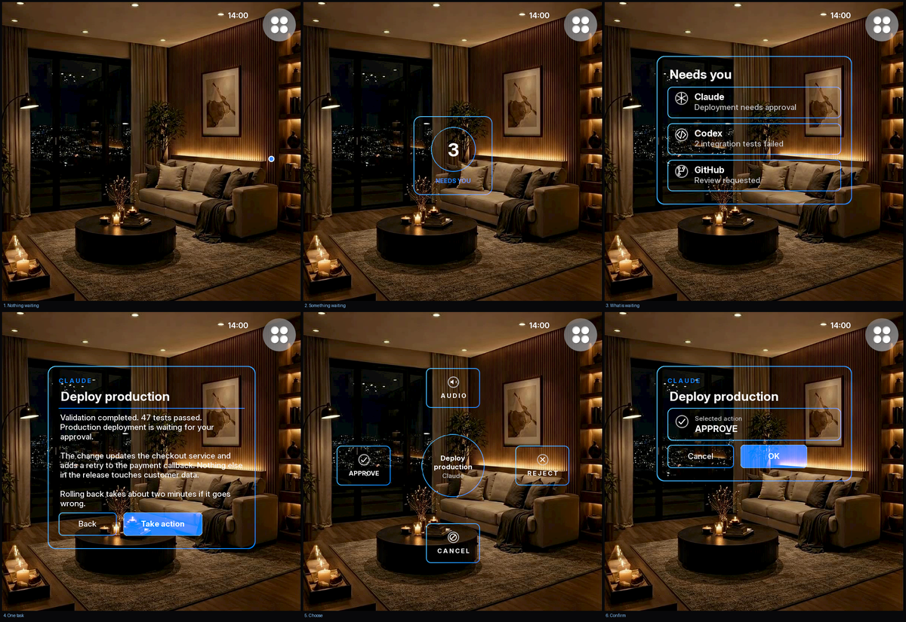
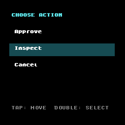

# Agent HUD

Agent HUD is a quiet display for keeping an eye on AI agents while you do
something else. It stays out of the way until an agent needs a human decision,
then lets you read the request and answer it deliberately.

The project now contains implementations for more than one smart-glasses
platform. Each platform has its own layout and controls, but they follow the
same safety rules and speak the same decision format.

| Raven Prism | Brilliant Labs Halo |
|---|---|
|  |  |
| [Full Raven guide](platforms/raven/README.md) | [Full Halo guide](platforms/halo/README.md) |

## The promise

Agent HUD is built around three plain rules.

**Quiet must mean quiet.** An empty list, a broken connection and an incomplete
reply are different states. A small warning remains visible when the display
cannot prove that nothing needs you.

**Moving focus is not acting.** Looking, tapping or moving through choices never
sends a decision. Choosing an action opens a separate confirmation screen. Only
the final confirmation can send it.

**The display says only what it knows.** `Sent` means the gateway accepted the
answer. It does not mean a deployment finished, a pull request merged or a job
succeeded. When that later work changes, the task itself must report it.

Every answer also carries the task revision and a stable decision ID. The
revision stops you answering an old version; the decision ID makes retry safe
when the first reply was lost.

## Platforms and validation status

| Platform | What is here | Evidence |
|---|---|---|
| [Raven Prism](platforms/raven/README.md) | Complete Python app, gaze-focused controls, audio reply flow and deploy entry point | Raven simulator and automated tests |
| [Brilliant Labs Halo](platforms/halo/README.md) | Complete Lua app, button/tap controls and Bluetooth message binding | Public Halo emulator and automated tests |
| MemoMind One | Research notes only | Not validated |

`Simulator validated` and `emulator validated` do not mean tested on physical
glasses. Hardware support will be claimed only after repeatable device testing.

## One contract, native experiences

```text
Agent tools ──> local gateway ──> decision contract
                                      │
                    ┌─────────────────┼─────────────────┐
                    │                 │                 │
                Raven Prism      Brilliant Halo    phone/browser
```

The common files under [`core/`](core/) define tasks, decisions, results and
the cases every platform must pass. They are data and documentation, not a
shared runtime library. Raven stays Python and uses the Raven Framework. Halo
stays Lua and uses the public Brilliant SDK. Neither app imports the other.

The local gateway and agent readers live at the repository root so platform
code does not need to know whether a request came from Claude Code, Codex,
OpenCode, GitHub or a hand-written test file.

## Try the gateway and Control

The default setup is local-only and uses invented sample tasks.

```bash
python -m venv .venv
# macOS / Linux
source .venv/bin/activate
# Windows PowerShell
# .venv\Scripts\Activate.ps1

pip install -e ".[dev,gateway]"
python -m stub_server.server
```

Open the address printed by the gateway and add `/control/` to use the phone or
browser interface. It follows the same choose, confirm and send flow as the
glasses.

The default bind is `127.0.0.1`. Moving the gateway onto a network requires both
authentication and TLS; it refuses to start with only half of that protection.
The [Raven guide](platforms/raven/README.md#agent-hud-control) contains the full
gateway, passkey, pairing, feeder and audio setup because Raven currently has
the live HTTP client. Halo's in-repository host code is still an emulator
framing helper, not a finished Bluetooth bridge to the live gateway.

## Repository map

| Path | Purpose |
|---|---|
| [`core/`](core/) | Platform-neutral task, decision and result contract |
| [`platforms/raven/`](platforms/raven/) | Raven runtime, assets and platform guide |
| [`platforms/halo/`](platforms/halo/) | Halo Lua app, emulator tests, evidence and platform guide |
| [`stub_server/`](stub_server/) | Local gateway, authentication and policy |
| [`feeders/`](feeders/) | Readers for agent tools and task sources |
| [`control/`](control/) | Phone and browser interface served by the gateway |
| [`tests/`](tests/) | Shared, gateway and Raven tests |

## Checks

Raven, the gateway and the common contract:

```bash
pip install -e ".[dev,gateway]"
pytest
ruff check .
```

Halo uses its own small environment because the emulator needs Python 3.12 or
newer and a pinned checkout of the public Brilliant SDK:

```powershell
Set-Location platforms/halo
git clone https://github.com/brilliantlabsAR/brilliant_sdk.git vendor/brilliant_sdk
git -C vendor/brilliant_sdk checkout f582b88bee798121c51bc483c2b0b4a85dd5e411
python -m pip install uv==0.12.17
python -m uv sync --frozen
python -m uv run pytest -q
```

Continuous integration runs both paths independently. Vendor SDK source and the
proprietary Raven Framework are never committed or placed in another platform's
package.

## Project status

- The common decision contract and conformance cases are in place.
- Raven has a separated platform runtime with pixel-stable simulator evidence.
- Halo is integrated as a clean MIT-licensed export with emulator evidence.
- Physical Halo validation and the live Halo-to-gateway Bluetooth bridge remain
  open work.

The reproducible counts and boundary checks are recorded in
[M3 integration results](docs/m3-results.md).

See [CHANGELOG.md](CHANGELOG.md) for release history, [CONTRIBUTING.md](CONTRIBUTING.md)
for contribution guidance and [SECURITY.md](SECURITY.md) for reporting security
issues.

## Independence and licence

Agent HUD is an independent project. It is not affiliated with Raven Resonance
or Brilliant Labs. Their frameworks, SDKs, trademarks and hardware remain their
own.

Agent HUD is available under the [MIT licence](LICENSE).
