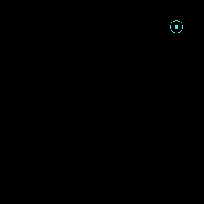
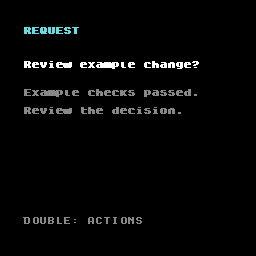
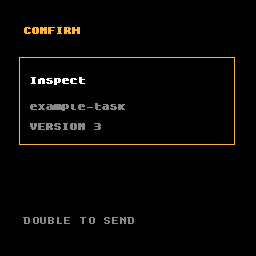
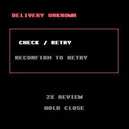
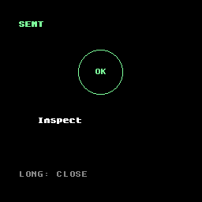

# Agent HUD for Brilliant Labs Halo

Agent HUD for Halo is a small Lua app that puts a human checkpoint on the
glasses. It remains blank when there is nothing to decide, shows a quiet marker
when an agent needs attention, and keeps choosing separate from sending.

This implementation is tested with the public Brilliant SDK and Halo emulator.
It has not been validated on physical Halo hardware. The Bluetooth messages are
implemented and testable, but the live bridge from the shared Agent HUD gateway
to a real pair of glasses is still open work.

> Agent HUD is independent and is not affiliated with Brilliant Labs. The
> Brilliant SDK stays a separate, pinned dependency and is not copied into this
> repository.

## How it looks

The Halo display is 256×256 pixels, so the design uses short lines, strong
outlines and a nearly empty resting state instead of shrinking the Raven layout.

| Needs attention | Read the request | Choose |
|---|---|---|
|  |  |  |

| Confirm | Delivery unknown | Sent |
|---|---|---|
|  |  |  |

Colour supports the message but never carries it alone: every important state
also has a heading, shape or explicit instruction. Quiet is a blank canvas.
A valid pending request adds only the small cyan ring in the top-right.

## The decision flow

```text
quiet -> needs attention -> request -> choices -> confirm -> sending -> sent
                                      |             |          |
                                    cancel        stale    delivery unknown
```

Opening a request does not send anything. Moving through choices does not send
anything. Selecting `Approve`, `Inspect` or another offered action only opens
the amber confirmation screen. The next deliberate double click is the only
step that sends a decision.

`SENT` means the receiver accepted the decision message. It does not mean the
agent's later work succeeded. When delivery cannot be proved, the app says
`DELIVERY UNKNOWN` and makes the wearer review the same frozen decision before
retrying. When the task revision changes, it says `STALE REQUEST` and blocks the
old answer.

## Controls

The app includes two input profiles. Profile B is the current candidate for a
future hardware study because moving focus and activating a choice use different
physical inputs. The emulator cannot tell us whether it is more comfortable or
less error-prone on real glasses, so profile A remains available as a baseline.

| Input | Profile A: button only | Profile B: button and tap |
|---|---|---|
| Single button click | Move to the next choice | Open the request or choices |
| Single tap | — | Move to the next choice |
| Double button click | Open, select or confirm | Select or confirm |
| Long button press | Back or close | Back or close |

Navigation never sends. Cancel and back never send. A repeated confirmation
while the app is already waiting for a result cannot create a second decision.

## What is shared with Raven

Halo and Raven do not share screen code. They share the meaning of a task, a
decision and a result through the repository's
[common contract](../../core/contracts/protocol.md).

Each decision contains:

- the task ID;
- the exact revision the wearer read;
- an action ID that the task actually offered;
- a decision ID that stays stable across retry.

The same language-neutral cases under [`core/conformance/`](../../core/conformance/)
run through Raven's Python adapter and the real Halo Lua state machine. Passing
them proves that both platforms make the same decision for those cases. It does
not prove Bluetooth reliability or physical-device ergonomics.

## Set up the emulator

Requirements:

- Python 3.12 to 3.14;
- Git;
- `uv` 0.12.17;
- the public Brilliant SDK at the pinned commit below.

From `platforms/halo/`:

```powershell
python -m pip install uv==0.12.17
git clone https://github.com/brilliantlabsAR/brilliant_sdk.git vendor/brilliant_sdk
git -C vendor/brilliant_sdk checkout f582b88bee798121c51bc483c2b0b4a85dd5e411
python -m uv sync --frozen
```

The SDK directory is ignored by Git. Do not commit it, copy it into `app/`, or
add it to a release archive.

On Windows, syncing the complete SDK workspace may try to install an audio
package that has no Windows build. The Halo project installs only the emulator
package it needs, so run `uv sync` here rather than at the SDK root.

## Run it

Profile A, button only:

```powershell
python -m uv run halo-emulator app
```

Profile B, button and tap:

```powershell
python -m uv run halo-emulator app --script main_profile_b.lua
```

The exact emulator keys depend on the public emulator version. The automated
tests use its input injection API, which calls the same Lua callbacks as an
interactive run.

## Tests

Run the complete Halo suite from `platforms/halo/`:

```powershell
python -m uv run pytest -q
```

Run one journey:

```powershell
python -m uv run pytest tests/test_m0_inputs.py::test_canonical_physical_inputs_retry_ack_and_screenshots -q
```

Run the official emulator suite inside the pinned SDK checkout:

```powershell
Set-Location vendor/brilliant_sdk/python
python -m uv run pytest packages/halo_emulator/tests/ -q
```

Tests write new screenshots and conformance reports under the ignored
`artifacts/` directory. The reviewed images under [`docs/images/`](docs/images/)
change only after a deliberate visual review.

## Files

| Path | Purpose |
|---|---|
| [`app/`](app/) | Lua app, state model, drawing, input and Bluetooth adapters |
| [`host/contract.py`](host/contract.py) | Emulator-side helper that frames common tasks and results |
| [`tests/`](tests/) | Emulator journeys, input checks and common-contract cases |
| [`docs/images/`](docs/images/) | Reviewed framebuffer evidence made from invented tasks |
| [`platform.json`](platform.json) | Machine-readable implementation and validation status |
| [`pyproject.toml`](pyproject.toml) | Isolated emulator test environment |

The app keeps platform calls behind three small files:

- `adapter_display.lua` owns the `frame.display` calls;
- `adapter_input.lua` maps buttons and taps to app events;
- `adapter_transport.lua` owns Bluetooth receive and send.

The state model and rules do not call the SDK directly. That keeps the safety
behaviour testable and makes changes to display or input less likely to change
what gets sent.

## Bluetooth messages

The common binding uses one leading byte followed by compact JSON:

| Direction | Code | Meaning |
|---|---:|---|
| Host to Halo | `0x12` | Session ID, common task and short display text |
| Host to Halo | `0x13` | Common result for the decision already sent |
| Halo to host | `0x22` | Common decision |

The app locks the first session ID for that run, creates a new numbered decision
ID on confirmation and reuses the full decision on retry. A result is accepted
only when its identity and revision match what is in flight. The older `0x10`,
`0x11` and `0x20` messages remain only for the original emulator regression
tests; a common session cannot be downgraded to them.

## Evidence and limits

Current evidence covers:

- quiet boot and attention marker;
- both input profiles;
- navigation and selection with zero sends;
- separate confirmation and one send;
- safe retry with the same decision ID;
- accepted, rejected, stale and unknown-delivery results;
- the same common decision cases as Raven;
- reviewed 256×256 framebuffer captures.

It does not cover:

- optical readability on a physical Halo;
- button or tap comfort and false positives;
- real Bluetooth latency, disconnects or reconnection;
- microphone and audio replies;
- a production bridge between Halo and the live Agent HUD gateway.

These limits are part of the product status, not footnotes. The platform remains
`emulator-validated` until those device checks exist.

The exact integration test counts and boundary checks are recorded in
[M3 integration results](../../docs/m3-results.md).

## Licence

The Halo adapter is part of Agent HUD and is licensed under the repository's
[MIT licence](../../LICENSE). The Brilliant SDK is a separate BSD-3-Clause
dependency at the pinned upstream commit.
